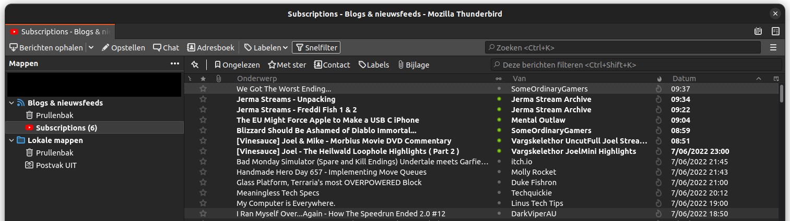

# Subs to RSS
A handy script that that converts your YouTube subscriptions into an RSS feed, so you don't end up down an endless rabbit hole watching prehistoric house building video's.

## Automated method

### Linux
This method assumes you have the following software:
- GNU/Linux (tested on Ubuntu 22.04)
- gnome-terminal (modify substorss.py to change)
- A browser: Chrome, Firefox or derivatives
- git for cloning this repo
- python-pip

Run the following bash command.
```bash
cd ~/Downloads && \
git clone "https://github.com/bramtechs/subs-to-rss" && \
cd subs-to-rss && \
pip install requests --user && \
python3 substorss.py
```
Follow the instructions outputted to your terminal and read **Final steps**.

### Windows
This method assumes you have the following software:
- git: for cloning this repo
- python3 with pip

> *Tip: use [Chocolatey](https://chocolatey.org/) or [Winget](https://docs.microsoft.com/en-us/windows/package-manager/winget/) to install software easily!*
> ```choco install python git -a```

Run the following powershell command.
```powershell
$ErrorActionPreference = "Stop"
cd ~/Downloads
git clone "https://github.com/bramtechs/subs-to-rss"
cd subs-to-rss
pip install requests --user
python substorss.py
```
Follow the instructions outputted to your PowerShell window and read **Final steps**.

## Manual method (cross-platform)

1) Go to https://www.youtube.com/feed/channels in your browser

2) Scroll to the bottom of the page so all channels are loaded. Press END or PAGE DOWN a few times...
3) Paste the following javascript (made by Jeb Nicholson https://gist.github.com/jeb5/da22862e469dea21e873acabb562f638), in the console window of your browser's dev-tools. (You might have to allow code pasting in your browser first.)
```javascript
javascript:if("https://www.youtube.com/feed/channels"==window.location.href){let e=[...document.querySelectorAll("#main-link.channel-link")].map(e=>{const[,t,n]=e.href.match("/((?:user)|(?:channel))/(.*)$");return"https://www.youtube.com/feeds/videos.xml?"+("user"===t?"user=":"channel_id=")+n}).join("\n");e?navigator.clipboard.writeText(e).then(()=>alert("A list of channel RSS feeds has been copied to the clipboard. \nPaste these into rssmix.com to generate a single RSS feed, or opml-gen.ovh to generate an OPML file.")).catch(()=>{console.log(e),alert("A list of channel RSS feeds has logged to the console. (Unable to copy to clipboard) \nPaste these into rssmix.com to generate a single RSS feed, or opml-gen.ovh to generate an OPML file.")}):alert("Couldn't find any subscriptions")}else alert('Please run at "https://www.youtube.com/feed/channels"');
```
4) Save the outputted list to a file and pass it down to the following script.

```bash
python3 list-rss.py channels.txt
```

## Final steps
Import the newly created OPML file ```~/Downloads/subs-to-rss/subscriptions.opml``` into an RSS reader, like Newsboat or Thunderbird.

[ubuntubuzz.com - How To Import OPML of RSS Feeds in Thunderbird ](https://www.ubuntubuzz.com/2017/04/how-to-import-opml-of-rss-feeds-in-thunderbird.html)

## Notice
Running any of my programs is at your own risk. I am not responsible for breaking/exploding your computer.
